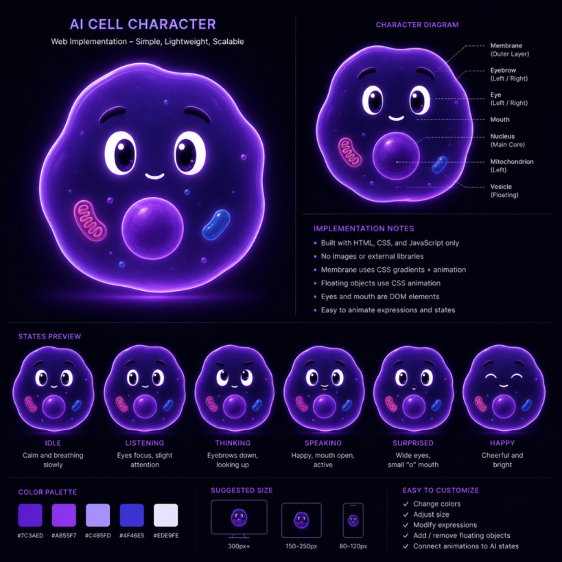

# AI Cell Character

A living, animated AI assistant avatar — a cute translucent purple cell — built as a production-ready React + TypeScript component. Rendered in SVG and driven by a centralized animation engine (single `requestAnimationFrame` loop, spring physics, procedural noise) that writes to the DOM directly, so React never re-renders during animation.



## Quick start

```bash
npm install
npm run dev     # demo playground at http://localhost:5173
npm run build
```

## Embedding the character

Everything you need lives in `src/cell/`. Copy that folder (or wire the project up as a package) and use:

```tsx
import { useRef } from 'react';
import { AICell, type AICellHandle } from './cell';

function Assistant() {
  const cell = useRef<AICellHandle>(null);

  // Wire into your AI pipeline:
  // cell.current?.setState('thinking');
  // cell.current?.setSpeaking(true);
  // cell.current?.setSpeechIntensity(audioAmplitude); // stream 0..1 in real time
  return <AICell ref={cell} size={280} initialState="idle" />;
}
```

### Imperative API (`AICellHandle`)

| Method | Description |
| --- | --- |
| `setState(state)` | Switch behavioral state (see list below). Smoothly spring-blends every body part. |
| `getState()` | Current state. |
| `setSpeaking(bool)` | Enter/leave speaking. Without a streamed intensity the character talks autonomously. |
| `setListening(bool)` | Enter/leave attentive listening. |
| `setExpression(state \| null)` | Face-only overlay on top of the current state (e.g. `happy` face while `processing`). |
| `setMood(mood)` | Long-lived bias: `neutral · happy · sad · tired · calm · energetic`. |
| `setEnergy(0..1)` | Global liveliness multiplier (speed, amplitude, glow). |
| `setSpeechIntensity(0..1)` | Real-time speech/audio amplitude. Lips articulate with a fast envelope (jaw drop, pseudo-visemes, tongue), while membrane, nucleus, glow and body react through a shared envelope with syllable emphasis. |
| `poke()` | Trigger a click reaction manually. |
| `setColor(color)` | Swap the body color: `violet` (default) · `blue` · `green` · `pink`. Also available as the `color` prop. |

All of these are also available as optional controlled props (`state`, `speaking`, `listening`, `mood`, `energy`, `speechIntensity`).

### States

`idle · listening · thinking · processing · speaking · happy · excited · surprised · confused · curious · focused · sad · worried · angry · sleepy · sleeping · error · success · loading · attention`

Each state changes eye direction, pupil scale, blinking cadence, eyebrow pose, mouth shape, membrane deformation, organelle motion, nucleus pulse, glow intensity and body movement together. Micro-behaviors (randomized blinking, gaze saccades, breathing, organelle drift, occasional micro-expressions) keep the character alive without robotic loops — plus rare bigger idle beats: yawns, stretches, sneezes, little wiggle-dances, peeking around, and chasing a floating dot with its eyes. Met tracks your cursor, greets you when it returns after a while, dents where you poke it, and gets annoyed → angry → overwhelmed if you spam-click (then calms down).

### Props

| Prop | Default | Description |
| --- | --- | --- |
| `size` | `'100%'` | Pixel number or CSS size. Looks great from ~96px to 400px+. |
| `initialState` | `'idle'` | State at mount. |
| `reducedMotion` | OS setting | Force-disable continuous motion (`prefers-reduced-motion` is honored automatically). |
| `atmosphere` | `true` | Soft halo behind the cell. |
| `ariaLabel` | `'AI assistant character'` | Accessible label for the SVG. |

### Performance & accessibility

- One `requestAnimationFrame` loop per character; all animation is applied via `setAttribute` with change-diffing — zero React re-renders.
- Automatically pauses when the tab is hidden or the component leaves the viewport.
- Honors `prefers-reduced-motion` (continuous wobble/bob/drift is disabled, state changes still transition gently).
- Cleans up all frames, observers and listeners on unmount; multiple instances can coexist (all SVG defs are namespaced per instance).

## Project layout

```
src/cell/          the reusable component library
  AICell.tsx       SVG scene + imperative API + DOM writer
  engine.ts        centralized animation/state engine (springs, schedulers, speech envelope)
  states.ts        20 state definitions, mood biases
  geometry.ts      membrane blob + morphable mouth + face layout
  math.ts          springs, seeded noise, colors
  types.ts         public types
src/App.tsx        demo playground (state grid, tour, voice streaming, moods, energy)
```
